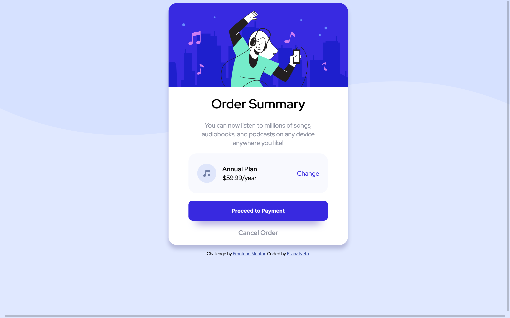

# Frontend Mentor - Order summary card solution

This is a solution to the [Order summary card challenge on Frontend Mentor](https://www.frontendmentor.io/challenges/order-summary-component-QlPmajDUj). Frontend Mentor challenges help you improve your coding skills by building realistic projects.

## Table of contents

- [Overview](#overview)
  - [The challenge](#the-challenge)
  - [Screenshot](#screenshot)
  - [Links](#links)
- [My process](#my-process)
  - [Built with](#built-with)
  - [What I learned](#what-i-learned)
  - [Continued development](#continued-development)
- [Author](#author)

## Overview

### The challenge

Users should be able to:

- See hover states for interactive elements

### Screenshot



### Links

- Solution URL: [My solution ](https://www.frontendmentor.io/solutions/order-summary-component-zIgUK-v7E)
- Live Site URL: [Live site URL here](https://eliananeto.github.io/order-summary-component/)

## My process

### Built with

- Semantic HTML5 markup
- CSS custom properties
- Flexbox

### What I learned

I learned to apply simple responsiveness 😅 🙃

```css
@media screen and (max-width: 375px) {
  ...;
}
```

### Continued development

I plan to continue doing Frontend Mentor challenges to improve my html, css and js skills 💪🏿 ⚡️

## Author

- Frontend Mentor - [@ElianaNeto](https://www.frontendmentor.io/profile/ElianaNeto)
- Twitter - [@eliana\_\_neto](https://twitter.com/eliana__neto)
